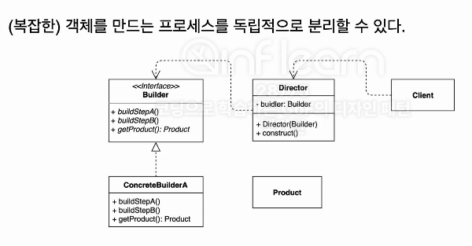

### 빌더(Builder) 패턴
- 동일한 프로세스를 거쳐 다양한 구성의 인스턴스를 만드는 방법.

### 장점
- 만들기 복잡한 객체를 순차적으로 만들 수 있는 방법을 제공해 줄 수 있다.
  - 또한 과정도 숨길 수 있다.
  - 클라이언트 코드는 깔끔해 질 수 있다.
- 불변 객체 생성 가능
- 유연성
  - Builder 패턴은 객체의 다양한 조합을 지원한다. 필수 매개변수와 선택적 매개변수를 명확히 구분할 수 있어, 객체 생성시 필요한 매개변수만 설정할 수 있다.
- 코드 중복 감소
  - 복잡한 객체 생성 로직을 Builder 클래스에 캡슐화하여, 객체 생성 코드의 중복을 줄일 수 있다.

### 단점
- 가독성 저하 (과도한 사용)
  - 동일한 프로세스지만, 세부적인 필드가 더 추가될 경우 (가령 특정 타입에 따라 다른 인스턴스를 가져야한다면) 복잡해 질 수 있다.
- 런타임 오버해드
  - Builder 패턴을 사용하면 객체 생성 시 추가적인 메서드 호출이 발생할 수 있어, 약간의 런타임 오버헤드가 발생할 수 있습니다.
- 복잡성 증가
  - 단순한 객체 생성에는 Builder 패턴이 불필요하게 복잡할 수 있다.
  - 객체 생성이 단순한 경우, 생성자나 팩토리 메서드 패턴이 더 적합할 수 있다.

### 빌더 패턴이 좋은지의 고민 의 영역에선 ...
- 사실 잘 모르겠다. 생성자를 만든이의 의도에 따라 여러개 만들면 될것 같다. 
  - (그러나 너무 많아지면 만들려고 하는 객체를 열어보는 순간 코드 라인이 길어지니 마음이 어려워 질 것 같고)

### 누군가 빌더 패턴 왜써요 ? 라고 물어본다면
- 음. 취향의 영역일 수도 있고 다소 어려운 말씀이네요, 저는 복잡한 구성요소의 객체를 생성시 사용합니다. 그렇지 않은 경우라면 생성자로 풀어내요 :).
